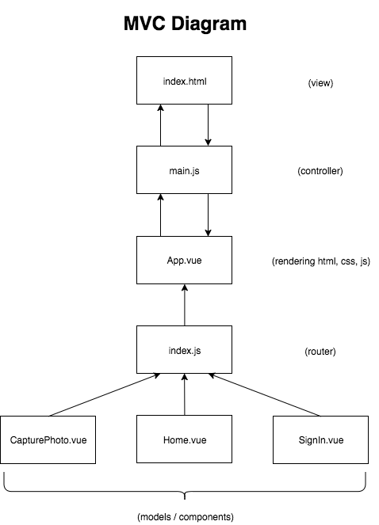

# posterpop!

[Tech Stack](#tech-stack) | [Setup](#setup) | [Testing Framework](#testing-framework) | [Our Blog](#our-blog) | [User Stories](#user-stories) | [Extra Features](#extra-features) | [Diagrams](#diagrams) | [Authors](#authors)

*__"Schedule your cultural life with a single snap"__*

Try __posterpop!__ for yourself [here](https://posterpop-app.firebaseapp.com).

<!-- adding video recording here -->

How often have you seen the poster of an event/exhibition on the street/tube, taken a picture of it thinking "I'd love to go there/do this!" and forgotten all about the event?

posterpop! is an app that uses text recognition to allow the user to photograph that poster and save the link for the event's website. That link is then stored in the user's profile and is shown on the app page. The user can then click on it to get redirected to the event's website at a later time.

## Tech Stack
- Front-End  
:iphone: [JavaScript ES6](https://www.javascript.com/)  
:iphone: [Vue 2](https://vuejs.org/)  
:iphone: [Bootstrap-Vue](https://bootstrap-vue.js.org/)

- Back-End  
:computer: [Node Modules](https://nodejs.org/api/modules.html)  
:computer: [Google Cloud Vision API](https://cloud.google.com/vision/)  
:computer: [Google Cloud Firebase](https://firebase.google.com/)  

- Testing  
:wrench: [Mocha](https://mochajs.org/)  
:wrench: [Karma](https://karma-runner.github.io/2.0/index.html)  
:wrench: [Nightwatch](http://nightwatchjs.org/)  
:wrench: [Selenium Web Driver](http://www.seleniumhq.org/projects/webdriver/)  
:wrench: [EsLint AirBnB](https://www.npmjs.com/package/eslint-config-airbnb)  
:wrench: [Lighthouse](https://developers.google.com/web/tools/lighthouse/)

## Setup

<!-- Check the whole API/FIREBASE key issue -->
<!--
1. Check if you have Node.js installed on your computer by running the command below
```
$ node -v
```
If you don't have it, install Node.js directly from the [node.js.org](https://nodejs.org/en/download/) website.

2. Clone the repo to your computer
```
$ git clone https://github.com/ker-an/posterpop.git
```

3. Install the node dependencies by running
```
$ npm install
```

4. Run the server
```
$ npm run dev
```

## Testing Framework
To check our tests, run the command below:
```
$ npm test
``` -->

## Our Blog
We have been documenting our journey on [Medium](https://medium.com/@team_processive/).

## User Stories
MVP

```
As a User,
So I can use the features of the app,
I want to be able to take a photo of a poster.
```

IMPLEMENTED FEATURES

```
As a User,
So that I can get more event information,
I want the app to be able to identify an event from a poster.
```

```
As a User,
So that I can get accurate event information,
I want to be redirected to the event's official website.
```

```
As a User,
So I can use the features of the app,
I want to be able to upload a photo of a poster.
```

```
As a User,
So that I can use the features of the app,
I want to be able to sign up.
```

```
As a User,
So that I can see the events that I have expressed an interest in,
I want to be able to log in to the app.
```

```
As a User,
So that I can see my researched events,
I want to see a list of my links when I log in.
```

```
As a User,
To protect the details of my account
I want to be able to log out of the app.
```

```
As a User,
So that I can remove events that I am no longer interested in,
I want to be able to delete links.
```

## Extra Features
Additional features not yet implemented are listed below.

```
As a User,
So that I can remember events I may be interested in,
I want the app to send me a reminder to book.
```

```
As a User,
So that I can remember what I have booked,
I want to be able to have the option to add the event to my calendar.
```

```
As a User,
So that I can be reminded to attend an event that I have booked,
I want to be able to choose a notification time frame.
```

```
As a User,
So that I can have all my tickets in one place,
I want to store my event tickets in the app.
```

```
As a User,
So that I can share the event with my friends,
I want the app to be integrated with social media platforms (i.e. Facebook).
```

```
As a User,
So that I can see the locations of my events,
I want to have them displayed on a map.
```

```
As a User,
So that I can know of similar events,
I want the app to be able to recommend events to attend.
```

```
As a User,
In case an event I'm interested in is sold out,
I want the app to recommend alternative dates or locations.
```

## Diagrams



## Authors

[Keran Braich](https://github.com/ker-an)  
[Lan Pham](https://github.com/Albion31)  
[Valentina Romeo](https://github.com/Ciancion)  
[Lea Rosamond](https://github.com/lea-rsm)  
[Nikolaos Sakellarios](https://github.com/lunaticnick)  
[Eleanor Wintram](https://github.com/ewintram)

## License
MIT
